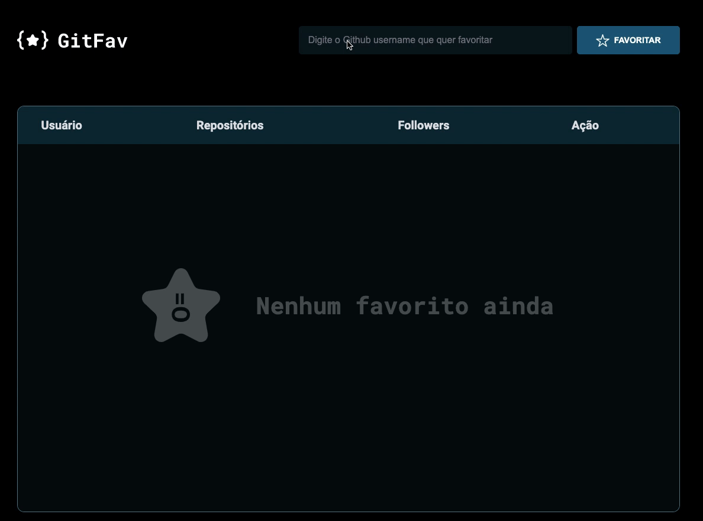

# GitFavs

## About

This project is part of the [Rocketseat](https://www.rocketseat.com.br/) program for learning how to code.

The objective of this project is:

- Use `fetch()` to make a request to the Github's API to get the user's data.
- Add and remove the favorite github users.

## Technologies

This project was developed using the technologies below:

- HTML
- CSS
- JavaScript

## Access the project:

- [https://cah90.github.io/explorer-stage6-gitfav/]

## How to install:

- Make a clone of the repository
- Access the folder in your computer
- You can run the project in your localhost using the [live-server]("https://ritwickdey.github.io/vscode-live-server/") or the [lite-server]("https://github.com/johnpapa/lite-server") tool.

---

Feito com ♥ by [cah](https://cassiabernardo.com)
